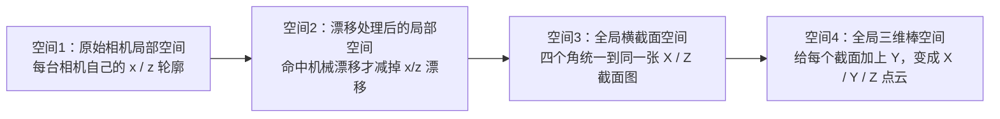
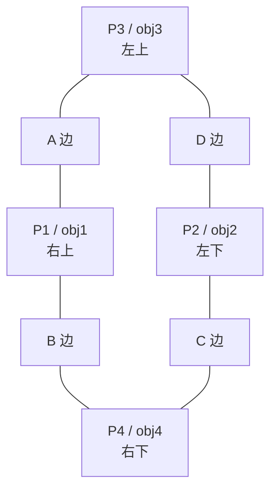
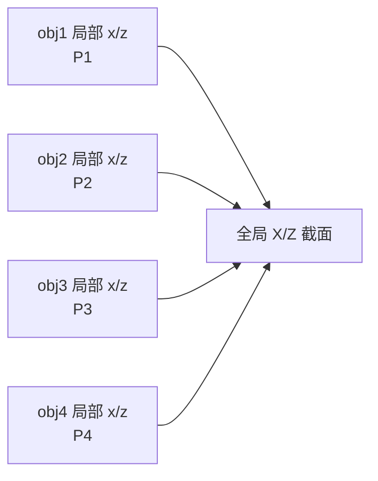
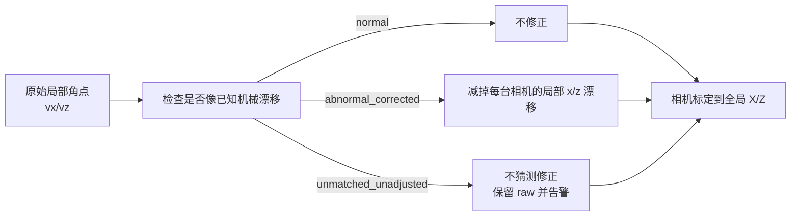
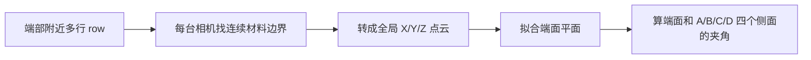
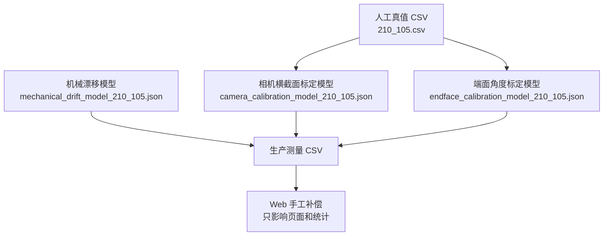
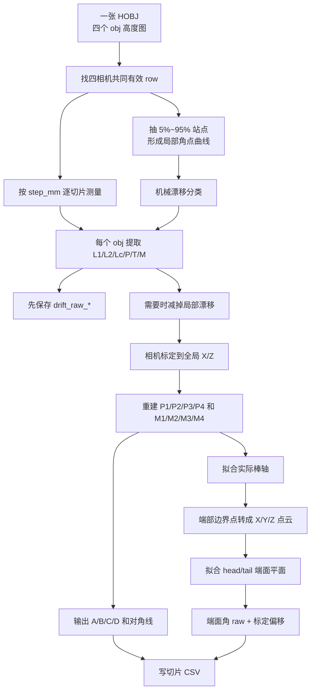

# 方棒测量算法小白图解版

这份说明只讲“机器到底怎么把四台相机的数据变成 CSV 数字”。尽量少用公式，多用图。

先记住一句话：

```text
四台相机各自看到一个角
        ↓
先在相机自己的小世界里找角点、倒角、主面
        ↓
再把四个小世界搬到同一个全局横截面
        ↓
最后沿棒长方向堆成 XYZ 三维棒
```

当前实际使用的文件是：

```text
tools/calibration/models/camera_calibration_model_210_105.json
tools/calibration/models/mechanical_drift_model_210_105.json
tools/calibration/models/endface_calibration_model_210_105.json
tools/calibration/truth/210_105.csv
```

## 1. 四个空间是什么

这里的“四个空间”不是玄学，就是数据经过四层坐标系。



可以把它想成四张地图：

```text
空间1：相机自己的小纸片

  z
  ↑          一条 row 轮廓
  |       __/\__
  |______/      \______
  +--------------------→ x


空间2：同一张小纸片，但把已知机械漂移挪回来

  原始角点 P_raw  ●
                ↙ 减掉漂移
  修正角点 P_fix ●


空间3：四台相机的小纸片拼成同一张截面图

  Z
  ↑
  |     P3 -------- A -------- P1
  |      |                       |
  |      D                       B
  |      |                       |
  |     P2 -------- C -------- P4
  +--------------------------------→ X


空间4：很多张截面沿棒长方向排起来

           Z ↑
             |
             |     一片截面
             |    □
             |       □
             |          □
             +----------------→ Y（棒长/扫描方向）
            /
           /
          X
```

## 2. 四台相机各负责哪个角

```text
P3 ---- A ---- P1
|              |
D              B
|              |
P2 ---- C ---- P4
```

```text
obj1 -> P1 右上角
obj2 -> P2 左下角
obj3 -> P3 左上角
obj4 -> P4 右下角
```

图上看是这样：



重点：四台相机原来各说各话。相机 1 的 x/z 和相机 2 的 x/z 不是同一张地图。相机标定的作用，就是把它们统一到同一张全局 X/Z 图上。

## 3. 每台相机的一条 row 怎么找一个角

每个 row 是一条高度轮廓。算法先从这条轮廓里找三条线：

```text
L1：倒角一侧主面
L2：倒角另一侧主面
Lc：中间倒角面
```

图像上大概这样：

```text
                  T1 ●
                     |\
                     | \   Lc（倒角面）
                 L1  |  \
                     |   ● T2
                     |
理论尖角 P      ●----+
                       L2
```

算法拿到的点：

```text
P  ：L1 和 L2 延长后交出来的理论尖角
T1 ：倒角面碰到 L1 的地方
T2 ：倒角面碰到 L2 的地方
M  ：T1 和 T2 的中点
```

这一层直接产出这些字段：

```text
objN_angle_deg
objN_verticality_error_deg
objN_chamfer_mm
objN_projection_x_mm
objN_projection_y_mm
objN_chamfer_face1_setback_mm
objN_chamfer_face2_setback_mm
```

别被 `verticality_error` 名字骗了。现在它保存的就是 L1/L2 的真实夹角，不再是“离 90 度差多少”。

倒角投影也别理解成相机 x/z 差。它现在是沿两条主面量出来的距离：

```text
                 T1 ●
                    |\
 projection_y       | \  chamfer_mm = T1 到 T2
 沿 L1              |  \
                    |   ● T2
                    |
P 理论尖角 ●--------+
         projection_x
         沿 L2
```

所以：

```text
objN_projection_x_mm = P 到 T2，沿 L2 方向
objN_projection_y_mm = P 到 T1，沿 L1 方向
```

## 4. 四个角怎么拼成 A/B/C/D

先把每个角点从“相机局部 x/z”转成“全局 X/Z”。



但不是简单把四个尖角连起来。算法会把每个角附近的两条主面也带过去，然后重新拟合四条全局边线：

```text
相机给的角点和主面点
       ↓
拼出 A/B/C/D 四条全局边线
       ↓
边线相交得到 P1/P2/P3/P4
```

图上是这样：

```text
         A 全局边线
      ─────────────────
       ╲              ╱
D 边线  ╲            ╱  B 边线
         ╲          ╱
      ─────────────────
         C 全局边线
```

最后 CSV 的边长就是：

```text
A_mm = P3 到 P1
B_mm = P1 到 P4
C_mm = P2 到 P4
D_mm = P3 到 P2
```

注意：默认 `free` 模式不强制 A=C，也不强制 B=D。真实测出来什么，就保存什么。

## 5. 对角线为什么用 M，不用 P

现在对角线按倒角中点算，不按理论尖角算。

```text
P1 是尖角延长线交点
M1 是倒角中点

       P3 corner                 P1 corner
          M3 ● ---------------- ● M1
              \                /
               \              /
                \            /
              M2 ● -------- ● M4
       P2 corner                 P4 corner
```

CSV 字段：

```text
diag1_M1_M2_mm = M1 到 M2
diag2_M3_M4_mm = M3 到 M4
```

如果某个角没有可靠倒角，算法会把对应 M 退回 P。也就是：倒角找不到时，不让整张图废掉。

## 6. 机械漂移层放在哪里

机械漂移不是相机标定，不是端面标定，也不是人工补偿。它只发生在“相机局部 x/z 还没转全局之前”。



漂移模型记录的是四台相机在绝对扫描行位置上的局部 x/z 漂移曲线。

```text
扫描行 Y 方向

5%   10%   15%  ...  95%
|-----|-----|---------|
  每个站点保存：
  obj1: drift_x / drift_z
  obj2: drift_x / drift_z
  obj3: drift_x / drift_z
  obj4: drift_x / drift_z
```

关键规则：

```text
normal
  幅度很小，像正常参考曲线，不修正。

abnormal_corrected
  曲线形状、幅度、四相机一致性都命中，才修正。

unmatched_unadjusted
  看起来不可靠，不猜。继续输出未修正值，并写告警。

not_applicable_orientation
  漂移模型方向不适用，比如模型只适合 normal，当前是 turnover。
```

CSV 里会同时保留两条轨道：

```text
drift_raw_A_mm / drift_raw_B_mm / ...
  漂移修正前的结果

A_mm / B_mm / ...
  最终结果。命中 abnormal_corrected 时是漂移修正后的结果；
  normal 或 unmatched_unadjusted 时基本就是未修正结果。
```

## 7. 端面怎么从 2D 变成 3D

横截面只看 X/Z。端面需要三维，所以算法给每个点加上 Y。

```text
X/Z 来自相机标定后的全局截面
Y 来自扫描 row 换算出来的棒长位置
```

端面点云长这样：

```text
          Z ↑
            |
            |   端面附近取很多边界点
            |      ● ● ● ●
            |    ● ● ● ● ●
            |  ● ● ● ● ●
            +----------------→ Y
           /
          /
         X
```

算法分别在头端、尾端附近取点：



端面有两类字段，别混：

```text
head_endface_plane_verticality_deg
tail_endface_plane_verticality_deg
  端面平面相对棒轴的角度。

head_A_endface_angle_deg ... head_D_endface_angle_deg
tail_A_endface_angle_deg ... tail_D_endface_angle_deg
  端面和四个物理侧面的夹角。

head_endface_verticality_deg
tail_endface_verticality_deg
  旧字段名，但现在数值是 A/B/C/D 四个端面夹角的平均值。
```

图上理解：

```text
一根棒：

      head 端面                      tail 端面
       ╱│                              │╲
      ╱ │                              │ ╲
     ╱  │                              │  ╲
    □---□==============================□---□
      ↑                                  ↑
  算 head 和 A/B/C/D 面夹角          算 tail 和 A/B/C/D 面夹角
```

## 8. 人工标定怎么配合全局算法

人工标定分三层，每层职责不同。



### 8.1 横截面相机标定

人工拿标准棒量出 3 段位置的 A/B/C/D，例如：

```text
15-25%
45-55%
70-80%
```

算法把这些人工边长还原成标准截面上的 P1/P2/P3/P4：

```text
人工 A/B/C/D
    ↓
标准截面 P1/P2/P3/P4
    ↓
每台相机找同一位置的角点
    ↓
求出 obj1..obj4 各自怎么旋转、平移到全局 X/Z
    ↓
保存 transforms 和 corner_biases
```

正向和调头分开保存：

```text
orientation_models.normal
orientation_models.turnover
```

调头时物理映射是：

```text
棒长位置：15-25 ↔ 70-80，45-55 不变
端面：head ↔ tail
面号：A -> A，B ↔ D，C -> C
```

> 上述映射只属于旧完整测量方案的软件面号体系。2026-07-13 新增的“专业机构端面专用离线包”采用机构报告横截面：A上、D下、C左、B右；该链路物理调头必须使用 `head ↔ tail、B ↔ C、A/D 不变`，不得复用上面的旧映射。

### 8.2 机械漂移模型

机械漂移模型不用人工真值直接拟合 A/B/C/D。它用同一根标准棒的正常 HOBJ 和异常 HOBJ，学习“异常时四台相机的局部 x/z 曲线长什么样”。

```text
正常 HOBJ：13_08、13_12、13_15
异常 HOBJ：10_08、11_59
    ↓
每个站点提取四个局部角点 vx/vz
    ↓
正常参考曲线
异常漂移曲线
    ↓
生产时每个 HOBJ 单独判断：
normal / abnormal_corrected / unmatched_unadjusted
```

这层一定要独立。不能把异常 HOBJ 混到相机标定里。

### 8.3 端面角度标定

端面标定更直观：先视觉算出 8 个 raw 角，再和人工量规角度比。

```text
head-A  head-B  head-C  head-D
tail-A  tail-B  tail-C  tail-D
```

每个角人工量 3 次，取平均。标定偏移就是：

```text
人工平均值 - 视觉 raw 平均值
```

生产时：

```text
视觉 raw 端面角
    ↓
加上对应 head/tail + A/B/C/D 的标定偏移
    ↓
输出 corrected 端面角
```

## 9. 每种被测数据怎么来的

```text
P1_x/P1_z ... P4_x/P4_z
  四个角在全局 X/Z 截面中的位置。

A_mm/B_mm/C_mm/D_mm
  P 点之间的四条边长。

M1_x/M1_z ... M4_x/M4_z
  倒角中点在全局 X/Z 中的位置。

diag1_M1_M2_mm / diag2_M3_M4_mm
  用 M 点算出来的两条对角线。

objN_angle_deg
  单个角两条主面的真实夹角。

objN_verticality_error_deg
  旧名字，新含义同 objN_angle_deg。

objN_chamfer_mm
  T1 到 T2 的倒角长度。

objN_projection_x_mm / objN_projection_y_mm
  从理论尖角 P 沿两条主面量到倒角端点。

objN_chamfer_face1_setback_mm / objN_chamfer_face2_setback_mm
  同样是 P 到 T1/T2 的退距，和 projection_y/x 对应。

stick_length_mm
  四台相机共同有效 row 范围换算出的棒长。

head/tail_*_endface_angle_deg
  端面和 A/B/C/D 四个侧面的夹角。

head/tail_endface_verticality_deg
  四个端面夹角的平均值。

head/tail_endface_plane_verticality_deg
  端面拟合平面相对棒轴的角度，不是四面平均。

drift_raw_*
  漂移修正前的原始几何结果。

drift_status / drift_warning / drift_reason
  说明这张 HOBJ 有没有命中已知机械漂移，以及为什么修或不修。
```

## 10. 一张 HOBJ 最终流程总图



## 11. 最容易混的几个点

```text
1. raw 不是废数据
   raw 是追溯用的原始测量，不能被覆盖。

2. corrected 不是强行拉回规格
   corrected 只来自明确模型：机械漂移、相机标定、端面标定。

3. unmatched_unadjusted 不是正常
   它只是“不敢修，但继续出数并告警”。

4. A/C、B/D 不强制相等
   默认 free 模式保留真实偏差。

5. 端面 verticality 字段名很旧
   现在它是四个端面夹角的平均，不是 abs(90-角度)。

6. Web 手工补偿是最后一层
   只改页面最终值和统计，不改切片 CSV，也不改模型。
```
